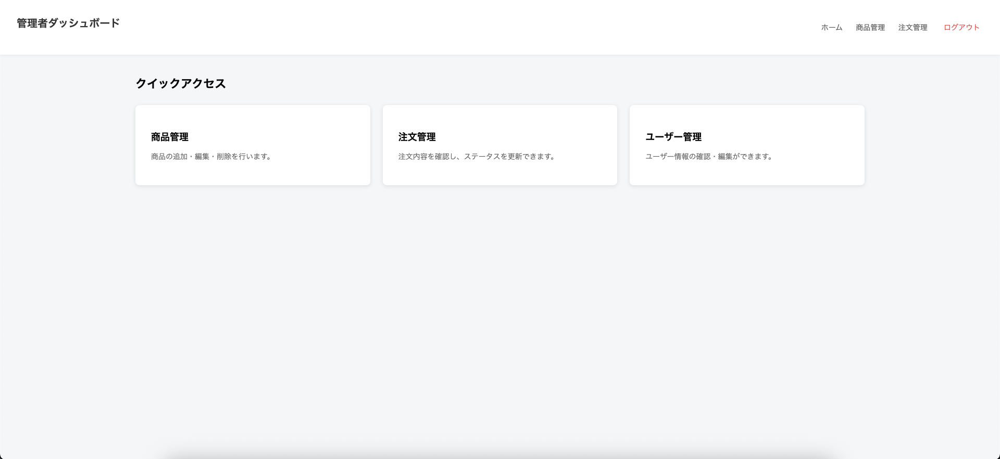
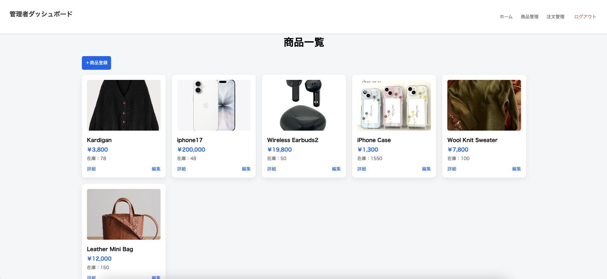
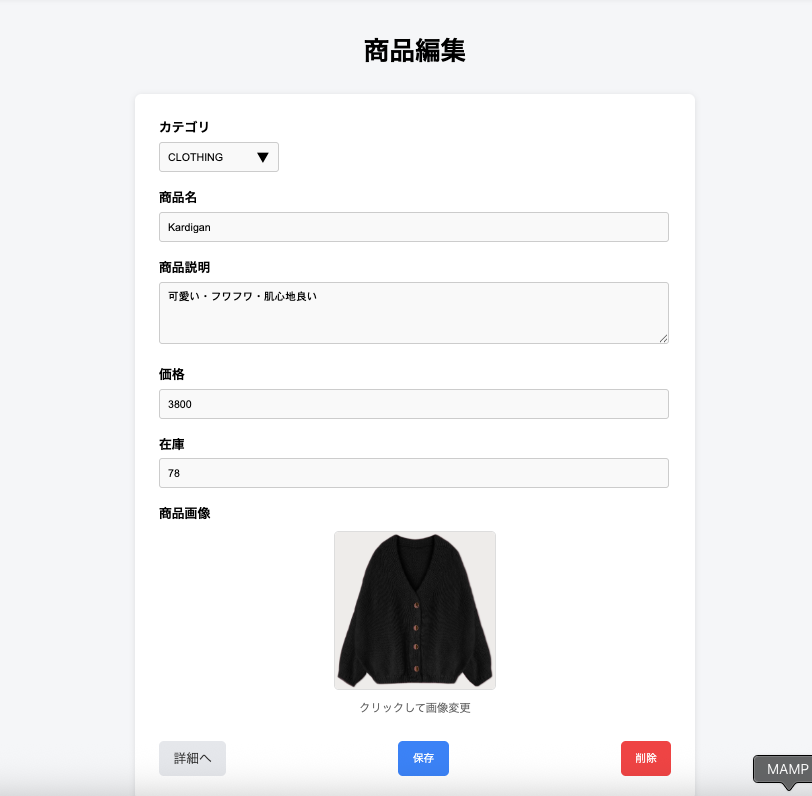
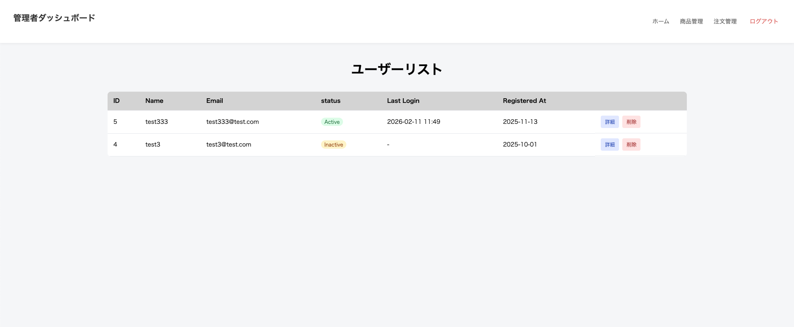
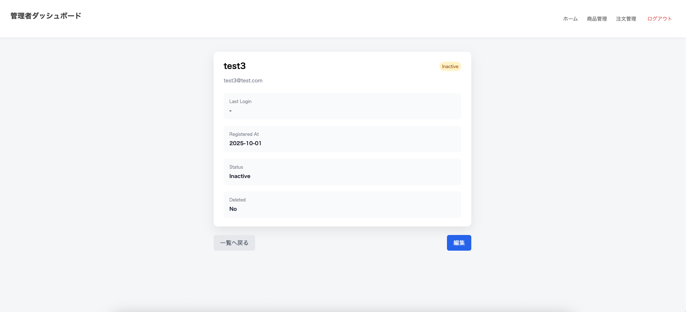

# j-store-back

## プロジェクト概要

ECサイトを想定したバックエンドAPIをLaravelで実装した個人開発プロジェクトです。  
商品管理・カート・注文処理・認証機能をAPIとして提供し、Nuxt.jsフロントエンドと連携する構成で構築しています。

また、APIとは別にLaravel Bladeを用いた管理画面も実装しています。

## 作成背景・目的

実務でLaravelを用いたECサイト開発に携わっているため、  
API設計・認証管理・決済処理・フロント連携までを一通り自分で設計・実装する経験を積むことを目的として作成しました。

特に以下を意識して開発しました。

- SPA（Nuxt）とのAPI連携構成
- Cookie認証とセッション管理
- CORS設定対応
- 環境変数による機密情報管理
- 管理画面とAPIの役割分離

## 主な機能

### 認証機能

- ログイン / ログアウト
- セッション・Cookieによる認証管理
- フロントエンドとの認証状態連携

### 商品機能

- 商品一覧API
- 商品詳細API

### お届け先管理機能

- 配送先住所の追加
- デフォルト配送先の設定
- 郵便番号入力時の住所自動補完機能

### 注文・決済機能

- 注文処理API
- Stripe決済連携
- 環境変数によるStripeキー管理

### 管理画面（Laravel Blade）

- 商品管理画面
- 商品登録
- 商品編集
- 商品削除
- ユーザー情報管理
- ユーザー情報の閲覧・編集
- Bladeテンプレートによる画面構築
- API機能と管理機能の分離設計

## 使用技術

### バックエンド

- Laravel
- PHP
- MySQL

### 認証 / 決済

- Laravel Session / Cookie
- Stripe API

### 開発環境 / その他

- Laravel（php artisan serve）
- MAMP（MySQLのみ使用）
- PHP 8.2.0
- Composer
- Git / GitHub

## 環境構築・起動方法

### バックエンド起動
```bash
git clone https://github.com/qqwqq97/j-store-back.git
cd j-store-back
cp .env.example .env
composer install
php artisan key:generate
php artisan migrate
php artisan serve
```
### フロントエンドについて

本バックエンドはNuxt.jsで実装したフロントエンドと連携する構成となっています。

フロントエンドを起動しない場合、  
ユーザー操作を伴う画面確認はできません。

フロントエンドリポジトリ：
https://github.com/qqwqq97/j-store-front.git

### フロントエンド起動方法

```bash
npm install
npm run dev
```

## 管理画面

管理者向けの商品管理・ユーザー管理機能を  
Laravel Bladeで実装しています。

### トップページ



### 商品管理画面





### ユーザー管理画面





## 環境変数について

Stripeキーなどの機密情報は `.env` ファイルで管理しています。  
`.env` はGit管理対象外としています。

例：

```
STRIPE_SECRET_KEY=*****
STRIPE_PUBLIC_KEY=*****
```

## 工夫した点・課題

### APIとフロントエンドの分離

Nuxtで作成したフロントエンドとLaravel APIを分けて構成しました。  
バックエンド側ではデータ処理・認証・決済処理に集中し、  
画面表示や状態管理はフロント側で行うようにしています。

役割を分けることで、どこを修正すべきかが分かりやすくなりました。

### CORSエラーへの対応

フロントとバックエンドを別ポートで起動していたため、  
開発中にCORSエラーが発生しました。

最初は原因が分かりませんでしたが、

- ブラウザの開発者ツールでリクエストヘッダーを確認
- Cookieが送信されているか確認
- Laravel側のCORS設定を見直し

といった作業を行い、設定を調整して解決しました。

通信の流れを意識して確認することの大切さを学びました。


### 管理機能とユーザー機能の分離

一般ユーザー向け機能と管理者向け機能を分けて実装しました。

- ユーザー向けAPI → フロントエンド連携用
- 管理者向けAPI → 管理画面（Blade）専用
- 管理画面UI → Laravel Bladeで実装

ルーティングやコントローラも分けて構成し、
処理が混在しないようにしています。


### 環境変数によるキー管理

StripeのAPIキーなどの機密情報は`.env`で管理し、  
Gitには含めないようにしました。

公開可能キーとシークレットキーの役割の違いも整理し、  
バックエンド側のみで秘密鍵を扱うようにしています。

### 単独での設計・実装

環境構築からDB設計、API作成、決済連携までを一通り自分で行いました。

実務では既存コードを触ることが多いですが、  
今回は構成を考えるところから実装まで経験できたことが大きな学びでした。

## 今後の改善予定

- バリデーション処理の整理と強化  
  現在は基本的なバリデーションのみ実装しているため、  
  エラーメッセージの統一や処理の整理を行いたいと考えています。

- APIレスポンス形式の統一  
  返却データの形式をより統一し、フロント側で扱いやすい構成に改善したいです。

- テストコードの追加 

- コード構成の見直し  
  コントローラに記述している処理の一部をサービス層へ切り出すなど、  
  責務をより明確にした構成へ改善したいと考えています。

- 例外処理の強化  
  現在は基本的なエラーハンドリングのみ実装しているため、  
  想定外のリクエストや不正な入力に対する処理をより明確にし、  
  エラーレスポンスの統一も行いたいと考えています。  

- 注文管理ページ作成 
